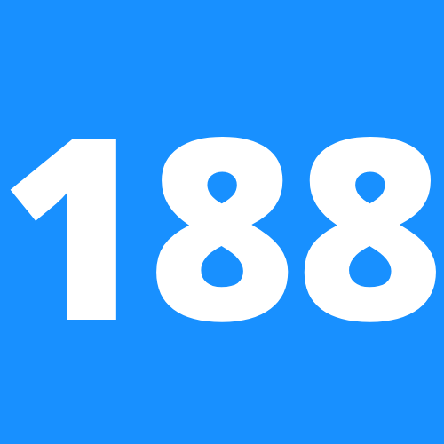

<!-- Improved compatibility of back to top link: See: https://github.com/othneildrew/Best-README-Template/pull/73 -->
<a name="readme-top"></a>

<!-- PROJECT LOGO -->
<br />
<div align="center">
  <a href="https://188goo.com">
    
  </a>

  <h3 align="center">A classified advertisements website with sections devoted to jobs, housing, for sale, and services for new Chinese immigrants.</h3>

  <p align="center">
    <a href="https://188goo.com"><strong>Explore the website »</strong></a>
    <br />
    <br />
    <a href="https://github.com/hon3g/188goo.com/issues">Report Bug</a>
    ·
    <a href="https://github.com/hon3g/188goo.com/issues">Request Feature</a>
  </p>
</div>

<!-- ABOUT THE PROJECT -->
## About The Project

[![Product Name Screen Shot][product-screenshot]](https://us-188.com/纽约)

There are many classified advertisements websites available in the Chinese immigrant community; however, I didn't find one that's simple, mobile friendly, and easy to use. I want to create a simple and beautiful website for job seekers and apartment renters to easily find what they are looking for as well as for advertisers to effortlessly create posts.

Here's why:
* Your time should be focused on creating something amazing. A project that solves a problem and helps others

<p align="right">(<a href="#readme-top">back to top</a>)</p>


### Built With
* Python Django Backend
* JavaScript React Frontend
* AWS (EC2, RDS SQL, S3, CloudFront, and VPC)
* Google Cloud (Authentication, Realtime NoSQL, and Storage)

<p align="right">(<a href="#readme-top">back to top</a>)</p>


<!-- GETTING STARTED -->
## Getting Started

This is an example of how you may give instructions on setting up your project locally.
To get a local copy up and running follow these simple example steps.

### Prerequisites

This is an example of how to list things you need to use the software and how to install them.
* python
  ```sh
  brew install python3
  ```
* npm
  ```sh
  npm install npm@latest -g
  ```

### Installation

Below is an example of how you can instruct your audience on installing and setting up your app.

1. Clone the repo
   ```sh
   git clone https://github.com/hon3g/188goo.com.git
   ```
2. Install Python packages
    ```sh
    python3 -m pip install -r requirement.txt
    ```
3. Install NPM packages
   ```sh
   npm install
   ```
4. Start backend server
   ```sh
   python3 manage.py runserver
   ```
5. Start frontend server
   ```sh
   npm start
   ```

<p align="right">(<a href="#readme-top">back to top</a>)</p>


<!-- CONTRIBUTING -->
## Contributing

Contributions are what make the open source community such an amazing place to learn, inspire, and create. Any contributions you make are **greatly appreciated**.

If you have a suggestion that would make this better, please fork the repo and create a pull request. You can also simply open an issue with the tag "enhancement".

1. Fork the Project
2. Create your Feature Branch (`git checkout -b feature/AmazingFeature`)
3. Commit your Changes (`git commit -m 'Add some AmazingFeature'`)
4. Push to the Branch (`git push origin feature/AmazingFeature`)
5. Open a Pull Request

<p align="right">(<a href="#readme-top">back to top</a>)</p>


<!-- LICENSE -->
## License

Distributed under the MIT License. See `LICENSE.txt` for more information.

<p align="right">(<a href="#readme-top">back to top</a>)</p>


<!-- CONTACT -->
## Contact

Hong Zhao - [LinkedIn](https://www.linkedin.com/in/hong-zhao-b371a1129/)

<p align="right">(<a href="#readme-top">back to top</a>)</p>


<!-- MARKDOWN LINKS & IMAGES -->
<!-- https://www.markdownguide.org/basic-syntax/#reference-style-links -->
[product-screenshot]: images/screenshot.png
